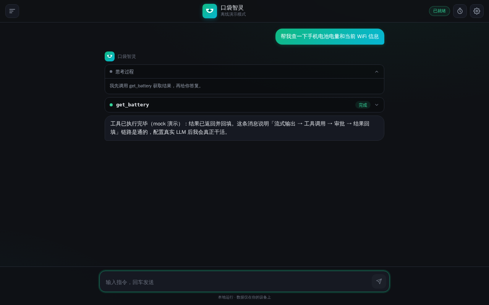
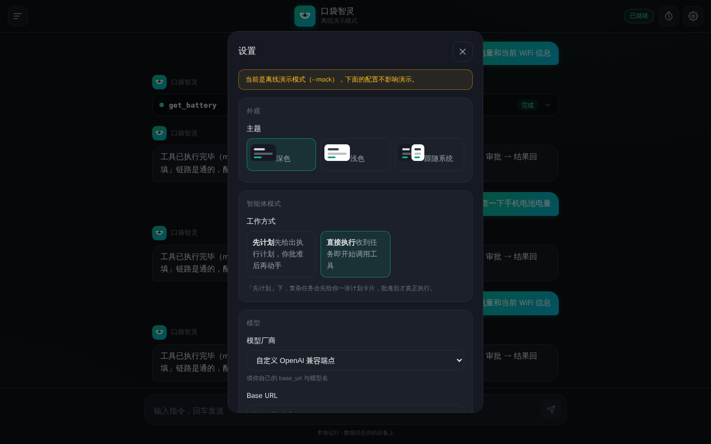
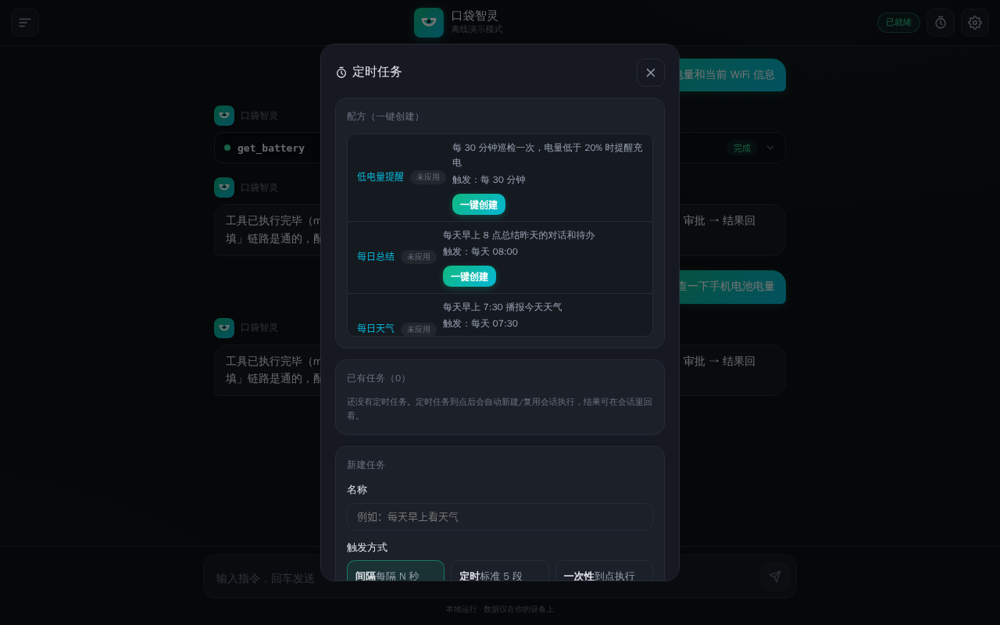
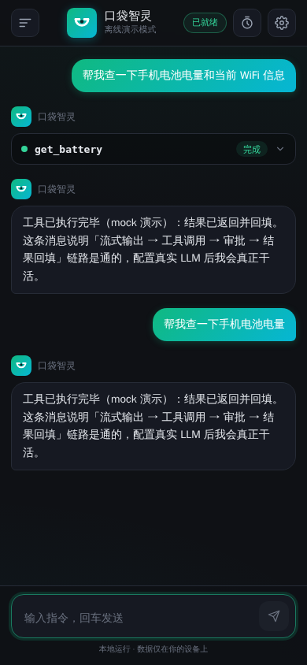

<div align="center">
  
  <h1>PocketMind · 口袋智灵</h1>
  <p><b>The always-on Agent that actually operates your phone — right from your pocket.</b> Local-first · Privacy-first · Native on Termux</p>
  
  
  
  
  <br />
  <sub>Web UI · PWA · MCP Server · Telegram Gateway · Recipes · Plan/Act Modes</sub>
</div>

**[English](README.md)** | [简体中文](README.zh-CN.md)

---

## Architecture

```
┌───────────────── One Android phone ─────────────────┐
│  Web UI (React, served by agentd, installable PWA)  │
│            ↓ SSE / REST (127.0.0.1:8787)            │
│  agentd (Python · FastAPI, single process)          │
│    ├─ Agent loop (stream → tool → approve → feed)   │
│    ├─ tools/ (shell / files / phone·termux-api)     │
│    └─ SQLite (sessions / messages / memory / jobs)  │
└──────────────────────────────────────────────────────┘
        ↓ tool calls                   ↓ inference
   termux-api (notify/sms/location/sensors…)   External LLM (OpenAI-compatible endpoint)
```

- **All data stays on-device**: sessions, messages, memory summaries, scheduled jobs and file backups live in a local SQLite database (0600/0700 perms); context survives restarts.
- **The LLM only reasons**: called through any OpenAI-compatible endpoint — configure `base_url` + `api_key` in the Settings panel.
- **Approval is enforced server-side**: write/shell/send-SMS/dial etc. require in-UI confirmation and auto-deny on timeout — the model cannot bypass it even when injected.

---

## Interface Preview

<p align="center">
  
  <br />
  <sub>Desktop · tool-call pipeline (get_battery completed)</sub>
</p>

<p align="center">
  
  <br />
  <sub>Settings · providers / Plan-Act mode / permissions & security</sub>
</p>

<p align="center">
  
  <br />
  <sub>Jobs · one-click recipes (low battery / daily summary / daily weather)</sub>
</p>

<p align="center">
  
  <br />
  <sub>Portrait · PocketMind on a real Termux phone</sub>
</p>

---

## Quick Start

### Option A: Web app on your phone (recommended, no APK needed)

```bash
# 1. One-time setup in Termux
pkg install git python termux-api
git clone <this-repo-url> && cd pocketmind
bash termux/install.sh          # Python/compile toolchain + deps + data dir (pydantic-core needs a one-off Rust build, ~3-8 min)

# 2. Start the service
bash termux/start.sh            # default http://127.0.0.1:8787

# 3. Open http://127.0.0.1:8787 in a browser
#    ⚙ Settings (top-right): pick a provider → enter API Key → save → chat
```

> Access from other devices on the same Wi-Fi: `bash termux/start.sh 8787 --lan` (set an access token in Settings first — required).

### Option B: Local development / try it out (no phone needed)

```bash
# Offline demo mode (no API quota, exercises the full pipeline)
cd pocketmind
AGENT_HOME=/tmp/pa python3 -m agentd.main --mock --port 8787
# Open http://127.0.0.1:8787 and send “check my battery / read my latest SMS” to see the tool pipeline

# Real mode (configure an LLM in Settings first)
AGENT_HOME=/tmp/pa python3 -m agentd.main --port 8787
```

---

## Repository Layout

| Path | Description |
|------|-------------|
| `agentd/` | **The only backend**: FastAPI (`main.py`) + agent loop (`agent.py`) + tools (`tools/`) + storage/scheduler |
| `agentd/web/` | React frontend (Vite + TS); built `dist/` is served directly by agentd |
| `termux/` | Phone side: `install.sh` one-click deps / `start.sh` launch / `boot.sh` boot autostart |
| `config/` | Preset recipes `recipes.json` (job templates); LLM provider presets in `agentd/config.py` → `PRESETS` |
| `tests/` | Regression suites (queueing / scheduled jobs / security hardening) |

---

## Daily Use

```bash
bash termux/start.sh            # start (or python3 -m agentd.main --port 8787)
bash termux/start.sh --lan      # LAN access (needs access token configured first)
```

## Data Boundaries & Security

- **Local**: agent code, sessions, file read/write, shell execution, termux-api calls, scheduled jobs;
- **Cloud (inference only)**: the LLM API. Agent context may carry local file contents — whitelist/sanitize sensitive files yourself;
- Listens on `127.0.0.1` by default; `--lan` enforces an access token;
- Default permission mode is **approve-per-action**: dangerous operations need in-UI confirmation and auto-deny on timeout (default 120 s, configurable);
- Files are auto-backed up before write/delete; you can undo from chat with one tap (`/api/undo`).

## Plan / Act Modes

Inspired by Cline's interaction design, the agent supports two modes:

- **Act (direct execution, default)**: calls tools, performs actions and returns results right away.
- **Plan (plan first, execute after)**: the agent first outputs an execution plan (including the tools it intends to call) without actually running anything; you click **Approve & Execute** to switch back to Act mode and re-send, or **Edit Plan** to refine the request in the input box.

**Switching**: Settings panel → "Agent mode", or `PUT /api/settings {"agent_mode": "plan"}`.
In Plan mode the SSE stream emits `{"type": "plan", "plan": "...", "tool_calls": [...]}` events, and `done.stop_reason` is `"plan"`.

## Recipes — One-Click Scheduled Jobs

Preset job templates live in `config/recipes.json`; built-in ones: low-battery alert, daily summary, daily weather, lunch reminder.

- **List**: `GET /api/recipes` returns every recipe with its `applied` status.
- **Apply**: `POST /api/recipes/{id}/apply` instantiates a scheduled job from the recipe (idempotent — repeated calls return the same job).
- The frontend Jobs panel lists recipes at the top — hit **one-click create**.
- Recipes support `interval` (seconds) and `cron` (min hour day month dow) triggers, plus a `battery < N` condition trigger.

## Telegram Remote Control

Drive the agent on your phone from a computer or any other device — send messages and approve requests via Telegram.

**1. Create a bot to get the token**: talk to `@BotFather` in Telegram → `/newbot` → copy the bot token (like `123456:ABC-xxx`). Send any message to your own bot, then visit
`https://api.telegram.org/bot<TOKEN>/getUpdates` and grab your `chat.id`.

**2. Configure (pick one)**:
- CLI flags:
  ```bash
  python3 -m agentd.main --tg-token 123456:ABC-xxx --tg-chat-id <your_chat_id>
  ```
- Or write into the `server` section of `$AGENT_HOME/config.json`:
  ```json
  { "server": { "tg_token": "123456:ABC-xxx", "tg_chat_id": "<your_chat_id>" } }
  ```

**3. Use it**: just message the bot in plain text (e.g. “check battery now”, “read my last five SMS”) — the agent replies with the result in Telegram.

**Approval flow**: on write/dangerous actions (send SMS, dial, write file, shell…), the bot posts a card with **✅ Allow / ❌ Deny** buttons; tapping one resolves the approval; 120 s without a tap auto-denies. Only your whitelisted `chat_id` can drive the agent — everyone else is ignored.

> Without `python-telegram-bot` installed or no token configured, the main service still starts normally — this entry is simply not enabled.
> Install: `pip install "python-telegram-bot>=20.0"` (optional dependency).

## MCP Server — Remote-Control Your Phone

Expose all on-phone tools (battery / SMS / location / files / shell… 31 tools) as standard MCP tools, so desktop **Claude Desktop / Cline / Codex** can call them over stdio — desktop LLMs operate this phone remotely.

**Start (standalone, no FastAPI)**:
```bash
python3 -m agentd.mcp_server        # equivalent: python3 -m agentd.main --mcp-server
```
Transport is stdio (MCP default); normally you don't run it manually — the desktop app launches it as a subprocess.

**Connect in Claude Desktop**: edit the config file
(macOS: `~/Library/Application Support/Claude/claude_desktop_config.json`,
Windows: `%APPDATA%\Claude\claude_desktop_config.json`) and add:
```json
{
  "mcpServers": {
    "pocket-agent": {
      "command": "python3",
      "args": ["-m", "agentd.mcp_server"],
      "cwd": "/path/to/pocketmind"
    }
  }
}
```
Same for Cline / Codex: add a stdio server entry — `command=python3`,
`args=["-m", "agentd.mcp_server"]`, `cwd` pointing at this repo root.

**Tool annotations**: dynamically read from the `agentd/tools/` registry; names match the web UI (`get_battery`,
`read_sms`, `run_shell`…). Every tool description carries a risk prefix —
`[safe]` read-only, run freely; `[write]` / `[danger]` desktop-side models should be cautious and require confirmation for high-risk actions.

## License

Apache-2.0 (this implementation, see [LICENSE](LICENSE))
